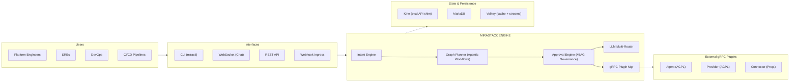
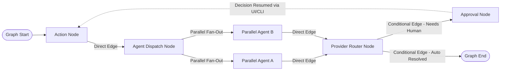
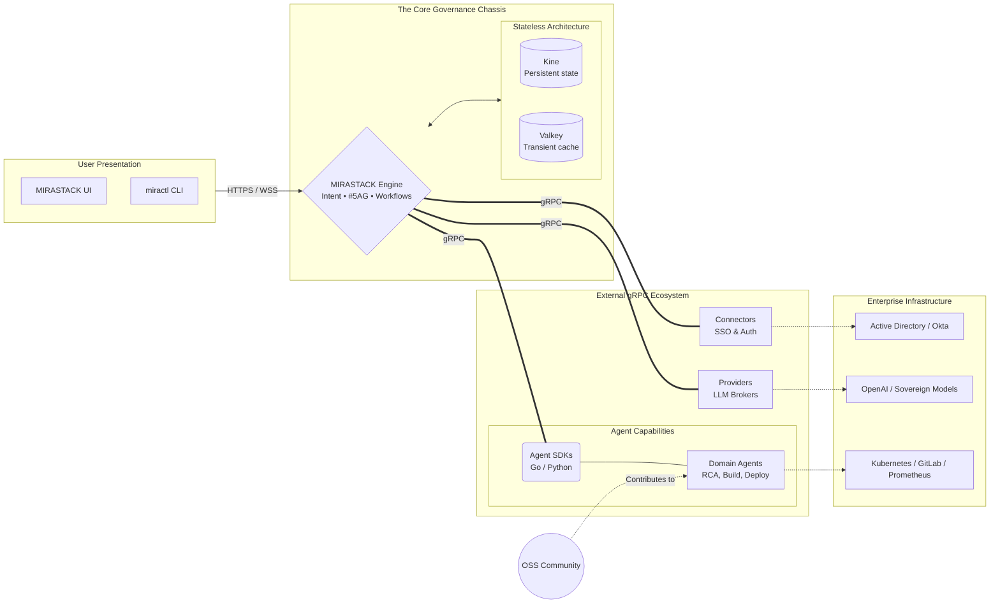

# MIRASTACK Framework — Sovereign Agentic Orchestration for Enterprise Infrastructure

**Maintainer:** MIRASTACK LABS Private Limited  
**Engine License:** Free for non-prod development/testing  
**SDK & Domain Agents License:** Open Source  
**Target Community:** Platform Engineers, SREs, DevOps practitioners operating in Data Centers, Private Clouds, and Sovereign Environments

---

## Table of Contents

1. [Vision and Purpose](#1-vision-and-purpose)
2. [What MIRASTACK Framework Is — and Is Not](#2-what-mirastack-framework-is--and-is-not)
3. [Core Design Principles](#3-core-design-principles)
4. [Architectural Overview](#4-architectural-overview)
5. [Framework Layers](#5-framework-layers)
6. [The Agentic Graph Engine](#6-the-agentic-graph-engine)
7. [The Plugin Protocol: Agents, Providers, Connectors](#7-the-plugin-protocol-agents-providers-connectors)
8. [The Prompt Template Engine](#8-the-prompt-template-engine)
9. [The Provider Layer](#9-the-model-adapter-layer)
10. [State Management and Checkpointing](#10-state-management-and-checkpointing)
11. [Capabilities and Actions (Skills)](#11-capabilities-and-actions-skills)
12. [Confidence and Explainability Primitives](#12-confidence-and-explainability-primitives)
13. [The #5AG Framework (Governance)](#13-the-5ag-framework-governance)
14. [Observability of the Framework Itself](#14-observability-of-the-framework-itself)
15. [Security Model](#15-security-model)
16. [Extension Points for the Community](#16-extension-points-for-the-community)

---

## 1. Vision and Purpose

MIRASTACK Framework combines a **Go-native agentic orchestration engine** (the core chassis) with an **Open Source Agent and SDK ecosystem** designed for platform engineers who operate in environments where data sovereignty, air-gap compliance, and operational reliability are non-negotiable constraints. The MIRASTACK Engine itself is completely free to use for development, testing, and non-production environments to ensure frictionless adoption.

The framework solves a specific and underserved problem: how to build reliable, explainable, human-governed AI agent pipelines that run entirely on-premises, with open-source language models, without any dependency on cloud APIs, managed services, or Python runtimes.

The broader LLM tooling ecosystem — LangChain, LangGraph, AutoGen, CrewAI — is built for Python, optimised for cloud-hosted frontier models, and assumes internet connectivity. None of these are acceptable constraints for a platform engineer managing a sovereign data center, a regulated financial institution, or a defense infrastructure environment.

MIRASTACK Framework is built from first principles for this context.

It is the orchestration substrate extracted from MIRADORSTACK — MIRASTACK LABS' production AI observability platform — generalised into a reusable framework that any platform engineering team can build on.

### Why Open Source

The platform engineering community operates on a foundation of open-source tooling. Kubernetes, Prometheus, Grafana, Terraform, ArgoCD, Helm — the entire operational stack is open source. An AI orchestration framework that sits on top of this stack should follow the same principle.

Open sourcing the SDKs, capability layer, and Agents creates a community of contributors who extend tool adapters, model adapters, and plugin integrations faster than any single team can. It establishes MIRASTACK as the standard for Go-native agentic AI in sovereign infrastructure.

---

## 2. What MIRASTACK Framework Is — and Is Not

### What it is

- A **Go-native agentic graph engine** for building multi-step AI investigation and decision-support workflows
- A **tool interface specification** with a clean, typed contract that any tool implementation must satisfy
- A **prompt template engine** with intent routing, conditional injection, and version management
- A **model adapter layer** that abstracts over different open-source LLM inference backends
- A **state management system** that carries typed context across graph nodes with checkpointing
- A **human-in-the-loop governance primitive** that defines where agent execution must pause for human approval
- A **plugin system** based on Go interface composition — no dynamic loading, no runtime reflection, no magic

### What it is not

- It is not a Python framework with Go bindings
- It is not a wrapper around LangChain or LangGraph
- It is not dependent on any cloud LLM API
- It is not an autonomous agent that takes actions without human approval
- It is not a general-purpose chatbot framework — it is specifically designed for structured operational intelligence workflows

---

## 3. Core Design Principles

### Air-Gap First

Every dependency in the framework must be resolvable without internet access. This means no CDN-fetched assets, no remote model APIs, no telemetry that phones home. The framework must be fully operational in a network-isolated environment with only a local inference server and local tool backends.

### 100% Decoupled gRPC Capabilities

Unlike frameworks that compile plugins into a single monolith or dynamically load risky `.so` libraries, MIRASTACK enforces a strict execution boundary. Every Agent, Provider, and Connector runs as an independent, external gRPC process. This radically minimizes the blast radius of any individual capability and enforces zero-trust execution.

### Explicit Over Implicit

Every decision the framework makes — which tool to call, which template to render, which node to execute next — must be traceable to an explicit configuration, not an emergent behaviour. This is critical for debugging agent failures in production and for satisfying compliance auditors who need to understand exactly how an AI-assisted decision was reached.

### Typed State, Typed Tools

The framework is strongly typed throughout. Graph state is a defined Go struct, not a map of strings to interfaces. Tool inputs and outputs are typed structs with explicit JSON contracts. This is what makes the framework reliable in production — the compiler catches a large class of errors that would only appear at runtime in a Python equivalent.

### Fail Loudly, Recover Gracefully

When a tool call fails, when a model produces output that cannot be parsed, when a graph node times out — the framework fails loudly with structured error context, then executes the configured recovery path. Silent failures that produce plausible-looking but incorrect results are the most dangerous failure mode in an AI system operating on production infrastructure. The framework is designed to make these impossible.

### Human Governance is a First-Class Primitive

Human approval gates are not an afterthought bolted onto the framework. They are a core graph construct — a node type that suspends execution, persists state, surfaces a decision request to a human interface, and resumes only when explicit approval is received. This is what makes the framework appropriate for platform engineering contexts where no autonomous action should be taken on production systems.

---

## 4. Architectural Overview

The MIRASTACK Framework is composed of six layers. Each layer has a clean interface boundary with the layer above and below it.

Each layer is independently testable and independently replaceable. A team can use the graph engine with a different prompt template system, or use the tool execution layer standalone without the graph engine.

---

## 5. Framework Layers

### Layer 1 — Graph Execution Engine

The graph engine is the heart of the framework. It implements a directed graph where nodes are processing units and edges are transitions between them. Unlike a simple pipeline, the graph supports:

- **Conditional edges** — routing decisions based on node output
- **Parallel node execution** — independent nodes execute concurrently using goroutines
- **Dependency-ordered execution** — nodes that declare dependencies on other nodes wait for those dependencies to complete
- **Cycle support** — graphs can loop back to earlier nodes, enabling iterative investigation and retry patterns
- **Suspension points** — human approval gates suspend graph execution indefinitely and resume from a persisted checkpoint

The graph is defined declaratively in configuration. Nodes reference named handler functions registered in the application. Edges define routing logic. The engine resolves execution order at startup and validates the graph for cycles that would cause infinite loops.

### Layer 2 — Prompt Template Engine

The template engine manages the composition of prompts from modular template fragments. It supports:

- **Intent-based routing** — selecting the appropriate template set based on classified user intent
- **Conditional template injection** — fragments are included or excluded based on runtime context flags
- **Variable interpolation** — typed struct fields are injected into templates with compile-time safety
- **Template versioning** — each template has a version identifier; the engine can be pinned to a specific version set
- **Partial templates** — shared fragments (timestamp formatting rules, anti-hallucination guardrails, confidence watermarking) are defined once and composed into domain templates

Templates are stored as files and seeded into a configuration database at deployment time. The engine reads from the database at runtime, enabling template updates without service restarts in environments that permit it.

### Layer 3 — Plugin Execution Layer

The execution layer manages the lifecycle of Agent and Provider calls within a graph execution. It handles:

- **Registry** — all plugins are registered via gRPC upon connecting with their typed action input and output schemas
- **Parallel dispatch** — actions without dependencies execute concurrently via Agents
- **Typed validation** — action inputs are strictly validated against their schema before dispatch; invalid inputs are rejected entirely before any external call is made
- **Result aggregation** — results from parallel action calls are aggregated into a unified format before routing to the next node
- **Audit recording** — every gRPC capability call, inputs, outputs, latency, and permission validation outcome are recorded to the audit log

### Layer 4 — Provider Layer (Brokered Models)

The provider layer intercepts logic requiring LLMs. The framework controls connections to external Provider Plugins used in sovereign environments. Providers implement simple inferencing endpoints that strictly proxy requests and responses:

- **Request formatting** — translating internal templates into structured outputs sent directly to LLM brokers
- **Format inference parsing** — fallback parsing mechanisms parsing JSON format from tools back to action requests
- **Stream mapping** — delivering progressive tokens smoothly across the websocket channels

### Layer 5 — State and Persistence Layer

The state layer manages typed context that flows through the graph execution. It provides:

- **Typed graph state** — the state struct is defined by the application and carries all investigation context across nodes
- **Immutable node outputs** — each node's output is recorded immutably; later nodes can read earlier outputs but cannot modify them
- **Checkpointing** — the complete graph state is persisted to durable storage at configurable intervals and at every human approval gate
- **Resume from checkpoint** — a graph execution can be resumed from any checkpoint, enabling recovery from failures and replay for debugging
- **Audit log** — a structured, append-only log of every state transition, tool call, model invocation, and human decision throughout the graph execution lifetime

---

## 6. The Agentic Graph Engine

### Node Types

The framework defines four fundamental node types:

**Action Node** — Executes a registered handler function with the current graph state as input and returns an updated state. This is the primary building block for all processing logic.

**Agent Dispatch Node** — Dispatches strictly validated, typed Action commands to external gRPC Agents. It enforces Schema constraints securely and waits for standard JSON outputs before continuing graph execution.

**Provider Router Node** — Handles all AI inferencing by stripping the payload of intent data and brokering a pure compute request to external Model Providers (e.g., OpenAI, vLLM, Ollama). It never executes domain logic.

**Approval Node** — Suspends graph execution, persists current state to a checkpoint, and emits a structured decision request. Execution resumes only when an explicit approval signal is received through the framework's approval interface. Approval nodes carry a timeout; if no approval is received within the timeout window, the graph transitions to a configurable timeout handler.

### Edge Types

**Direct Edge** — Unconditional transition from one node to another.

**Conditional Edge** — Transition determined by a routing function that inspects the current graph state and returns the name of the next node. This is how investigation loops, retry cycles, and confidence-based branching are implemented.

**Parallel Edge** — Fans out to multiple nodes that execute concurrently. A join node downstream of the parallel fan-out waits for all parallel paths to complete before proceeding.

**Terminal Edge** — Marks the end of a graph execution path. A graph can have multiple terminal edges representing different completion states — success, insufficient data, human declined, timeout.

### Cycle Detection and Loop Safety

The graph engine validates the graph topology at startup and identifies all cycles. Cycles are permitted — they are the mechanism for iterative investigation loops — but the engine requires that every cycle includes at least one node that can emit a terminal edge. This prevents infinite loops at the structural level. Additionally, every cycle node tracks its iteration count in graph state, and the framework enforces a configurable maximum iteration count beyond which the cycle is broken and the graph transitions to a configured exit handler.

---

## 7. The Plugin Protocol: Agents, Providers, Connectors

### The Lego-Block Modularity

MIRASTACK is designed as a highly modular, Lego-like ecosystem. The core governance chassis handles intent, #5AG governance, workflows, and state, while all actual capabilities (Connectors, Providers, and Domain Agents) live entirely outside the engine boundary. They communicate securely over gRPC, extending the framework without risking the stability of the core.

### The Core Interface

Every external capability in MIRASTACK implements a single gRPC interface. The interface is intentionally minimal — the richness is in the typed inputs and outputs, not in the interface signature.

There are exactly three types of plugins:
1. **Agents:** AI agents that perform tasks on external systems (READ, MODIFY, ADMIN).
2. **Providers:** AI LLM inference brokers that actually call LLMs (OpenAI, Anthropic, vLLM, Ollama).
3. **Connectors:** Integrations connecting the engine to enterprise auth and identity systems (ActiveDirectory, OpenLDAP).

A plugin has:
- A unique name used for registration and invocation
- A category for grouping and filtering
- A human-readable description that is included in the model's prompt context
- A structured registry of supported **Actions** (skills) with typed schemas
- An execute function that receives typed input and returns typed JSON output or an error

### The Action Envelope

All executions flow through a shared envelope. This is the single most important architectural decision in the framework — it means the orchestration layer and the model always interact with one consistent structure regardless of which agent or action is being invoked.

The request envelope carries:
- A unique call identifier for correlation across logs
- The agent or provider name
- The specific action to run
- The raw input payload, validated against the action's input schema before dispatch
- Metadata including the calling node, the graph execution identifier, and the timestamp

The response envelope carries:
- The call identifier from the request
- A success flag
- The JSON output payload on success
- A structured error on failure, with a machine-readable error code and a human-readable message suitable for inclusion in the model's next prompt

### Action Categories

The framework defines standard action categories that inform intent routing and tool selection:

- **Discovery** — actions that enumerate available resources, services, metrics, and signals
- **Data Collection** — actions that retrieve time-series data, log entries, and trace records
- **Correlation** — actions that compute relationships between signals across data sources
- **Analysis** — actions that apply analytical functions to collected data
- **Mutation** — actions that effect changes in external systems, always requiring an approval node upstream
- **Notification** — actions that emit alerts, create tickets, or send messages

### Schema Evolution

Action input and output schemas are versioned. The framework supports schema evolution with backward compatibility rules — new optional fields can be added to a schema without breaking existing callers. Breaking changes to a schema require a new action version. The plugin registry maintains all versions; the graph configuration specifies which version of each action it expects.

---

## 8. The Prompt Template Engine

### Template Composition Model

Prompts in the MIRASTACK Framework are not monolithic strings. They are composed from fragments at render time based on the runtime context. This composition model is what allows a single framework to produce appropriately specialised prompts for incident response, capacity planning, security analysis, change impact analysis, and a dozen other intent domains — without maintaining separate codepaths for each.

A rendered prompt is assembled from:

**System Identity Fragment** — Establishes who the model is, what its core responsibilities are, and what its non-negotiable behavioural constraints are. This fragment is the same across all intent domains.

**Data Model Fragment** — Describes the data sources available in this deployment, the query languages used to access them, and the naming conventions that must be respected. This fragment is deployment-specific and is injected from configuration.

**Tool Definition Fragment** — Lists the tools available for this request, with their descriptions, parameters, and usage guidance. The set of tools included is filtered to those relevant to the current intent.

**Intent Guidance Fragment** — Provides intent-specific workflow guidance — the sequence of tools to invoke, the analytical approach to apply, the output structure expected. This fragment is selected by the intent router.

**Domain Template Fragment** — The primary template for the intent domain. Contains the full prompt structure including response format, confidence watermarking requirements, citation requirements, and anti-hallucination guardrails.

**Context Injection** — Runtime data injected into the rendered prompt — discovered services, available metrics, REDA baseline values, previous investigation results, conversation history.

### Intent Routing

The intent router classifies the user's query into an intent category and sub-intent. The classification informs which domain template to load and which tool set to expose. The router operates as a lightweight classifier — either a fine-tuned model for high-accuracy classification or a rules-based system for deterministic behaviour in constrained environments.

The intent taxonomy is extensible. New intents are registered with their template mappings and tool filters. The framework ships with a standard intent taxonomy covering the core observability and platform engineering use cases. Community plugins can extend the taxonomy.

### Template Versioning and Promotion

Templates are source-controlled as files in the application repository. A seeding process loads templates into the configuration database with a version identifier at deployment time. The framework runtime reads templates from the database by version.

This creates a promotion pipeline:

Development → staging template version → production template version

Each environment runs a pinned template version. Promoting a template change follows the same process as promoting a code change — it requires a commit, a review, a staging validation, and a deliberate promotion action.

The version identifier used at runtime for each investigation is recorded in the audit log alongside the model name and version. This means any investigation can be exactly reproduced by replaying the same inputs against the same template version and model version.

---

## 9. The Provider Layer

### The Adapter Interface

The model adapter interface defines a single operation: given a prompt and a set of constraints, return the model's response in a normalised format. All backend-specific complexity — authentication, request formatting, response parsing, retry on transient errors — lives inside the adapter implementation.

### Supported Inference Backends

The framework ships with adapters for inference backends commonly used in sovereign and air-gapped environments:

**Ollama** — The simplest deployment path. Ollama manages model download, quantisation selection, and inference. The MIRASTACK adapter uses Ollama's OpenAI-compatible API. JSON mode is available but schema-constrained output is not; the adapter implements a retry-with-error-feedback loop for schema conformance.

**LMStudio** — Identical API surface to Ollama from the adapter's perspective. Used primarily in development and evaluation environments. The adapter notes that LMStudio does not expose grammar-constrained output and applies the same retry loop.

**llama.cpp Server** — The most flexible backend for production air-gapped deployments. The adapter supports GBNF grammar files for schema-constrained output, which eliminates the retry loop and significantly improves reliability. Recommended for production deployments.

**vLLM** — The recommended backend for production deployments on GPU infrastructure. The adapter uses vLLM's `guided_json` parameter to pass JSON schema constraints directly to the inference engine. This provides the strongest reliability guarantee for structured output. Supports both CUDA and ROCm (AMD) backends.

**text-generation-inference (TGI)** — Hugging Face's inference server. The adapter supports TGI's grammar parameter for constrained decoding. Used in environments where the team has existing Hugging Face infrastructure.

**Custom OpenAI-compatible endpoints** — Any inference server that implements the OpenAI-compatible `/v1/chat/completions` API can be used with the generic adapter. Schema conformance relies on the retry loop.

When the inference backend supports constrained decoding, model family detection is bypassed — the schema constraint makes the output format irrelevant.

### Reliability Under Open Source Model Constraints

Open source models produce structurally invalid output more frequently than frontier models. The adapter layer implements a structured reliability strategy:

**Parse-validate-retry loop** — When the model's output cannot be parsed or fails schema validation, the adapter constructs a correction prompt that includes the original prompt, the model's invalid output, and a precise description of the error. The model is given up to a configurable number of attempts to produce valid output before the adapter returns a failure.

**Temperature management** — Tool call generation is invoked at very low temperature to reduce creative variation and improve schema adherence. Analysis and synthesis phases can use higher temperature to encourage more nuanced reasoning.

**Output truncation detection** — Some model and context-length combinations result in truncated output. The adapter detects truncated JSON and either requests completion or returns a structured truncation error.

---

## 10. State Management and Checkpointing

### Typed Graph State

Graph state is the single source of truth for everything that has happened in a graph execution. It is a typed Go struct defined by the application — not a generic map. This means the compiler validates that every node reads and writes state fields that actually exist, with the correct types.

The framework defines a base state interface that every application state struct must satisfy. The base interface carries the fields the framework itself needs: execution identifier, current node, iteration count, error context, and audit trail reference. The application extends this with its own domain-specific fields.

### Immutability and the State Transition Log

Each node receives the current state as input and returns a new state as output. The framework records every state transition — the node that produced it, the timestamp, and a diff of the fields that changed. This transition log is the foundation of the audit trail and enables replay of any execution from any point.

Nodes do not modify state in place. They return a new state struct. The framework merges the node output into the current state and records the transition. This immutability guarantee means that any node can be safely retried — its output replaces the previous output in the transition log rather than accumulating side effects.

### Checkpointing

Checkpoints are complete serialised snapshots of graph state persisted to durable storage. The framework creates checkpoints:

- At every human approval gate, before suspending execution
- At configurable intervals during long-running graph executions
- At graph completion, both on success and on failure

The checkpoint store interface is abstract — implementations are provided for common storage backends available in sovereign environments: SQLite for single-node deployments, PostgreSQL for multi-node, and a filesystem backend for the simplest air-gapped scenarios.

### Resume and Replay

Any checkpoint can be used as the starting point for a new execution. Resume continues a suspended execution from where it stopped — the primary use case is human approval gate resumption. Replay re-executes the graph from a checkpoint with the same inputs — the primary use case is debugging and post-incident analysis.

---

## 11. Capabilities and Actions (Skills)

### Design Philosophy

The MIRASTACK Framework plugin system is based exclusively on highly decoupled external gRPC processes. Nothing executes embedded within the core engine. A plugin connects via the gRPC SDK, authenticates with the Engine, and advertises a registry of Actions/Skills that it supports. 

This is a deliberate architectural choice. Dynamic plugin loading points (like Python runtimes or `.so` libraries) create security audit challenges, introduce arbitrary execution vulnerabilities, and limit language freedom. For sovereign infrastructure deployments, the simplicity and network boundaries of typed gRPC calls drastically limits blast radiuses, trading single-binary density for true process isolation and safety.

### SDK-Driven Integration

The framework provides specific SDKs (starting with Go and Python) for external capabilities:

**Agent SDKs** — Used to write domain Intelligence (Kubernetes Troubleshooting, AWS Cost Analyzers). They declare `Action` definitions with strict `InputParams`, `OutputParams`, `Permission` tiers (READ, MODIFY), and `Intent` bindings. The Engine routes tasks to them, leaving the agent as pure stateless compute.

**Provider SDKs** — Stripped to essentials for routing prompts to inference backends. You don't use Providers to process actions; the Engine brokers API access transparently using these.

**Connector SDKs** — Internal framework-extending pathways primarily focusing right now on Auth/SSSS connections.

### Capability Registry

At startup, the engine connects to plugins, queries for Schema definitions, and the Agent replies with a typed Action list that gets stored persistently in Kine (`/plugins/{name}`). Validation checks that all declared JSON Schema parameters conform firmly to JSON spec. If a prompt instructs the LLM to call an unknown action or hallucinate parameters out of schema bounds, the Engine's interceptor layer strictly forbids execution.

---

## 12. Confidence and Explainability Primitives

### The Confidence Model

Every finding produced by the MIRASTACK Framework carries a structured confidence annotation. Confidence is not a single number — it is a typed struct that carries:

- **Evidence basis** — whether the finding is directly from tool results (HIGH), inferred from data patterns (MEDIUM), or an educated hypothesis requiring further investigation (LOW)
- **Supporting evidence** — a list of specific tool results and data points that support the finding, with source attribution
- **Contradicting evidence** — a list of data points that are inconsistent with the finding, if any
- **Verification steps** — specific queries or checks that would move this finding from MEDIUM to HIGH confidence

The confidence model is enforced at the prompt level — domain templates require the model to populate these fields for every finding — and validated at the output parsing level — the framework's output parser checks that required confidence fields are present before accepting a node's output.

### The Audit Trail

The audit trail is a structured, append-only record of every significant event in a graph execution. It is designed to satisfy two audiences: platform engineers who need to understand how a conclusion was reached, and compliance auditors who need to verify that AI-assisted decisions followed approved processes.

Every entry in the audit trail carries:
- Timestamp with millisecond precision
- Graph execution identifier
- Node name and iteration number
- Event type — tool call, model invocation, state transition, human decision, approval gate
- Structured event payload — for tool calls, the full request and response envelope; for model invocations, the template version, model identifier, and token counts; for human decisions, the decision identifier, the human identifier, and the decision outcome
- The confidence annotation of any finding produced by the event

The audit trail is immutable and is persisted separately from the checkpoint store. It survives graph failures and is retained according to configurable retention policy.

---

## 13. The #5AG Framework (Governance)

MIRASTACK enforces governance as a non-bypassable engine primitive. The #5AG framework guarantees enterprise compliance on every execution:

  

    <h4 style="margin-top: 0; margin-bottom: 0.75rem; font-family: 'JetBrains Mono', monospace; font-size: 1.0rem; color: var(--accent); text-transform: uppercase; letter-spacing: 1px;">01 / Authentication</h4>
    
<strong>PASETO:</strong> Symmetric PASETO tokens handle all active engine sessions directly linked to strict operator identities without in-memory bloat.

  

  

    <h4 style="margin-top: 0; margin-bottom: 0.75rem; font-family: 'JetBrains Mono', monospace; font-size: 1.0rem; color: var(--accent); text-transform: uppercase; letter-spacing: 1px;">02 / Authorisation</h4>
    
<strong>RBAC:</strong> Three rigidly enforced roles (<code>operator</code>, <code>engineer</code>, <code>admin</code>) govern execution. Only <code>engineer</code>+ roles trigger agentic loops; <code>admin</code>+ gate destructive executions.

  

  

    <h4 style="margin-top: 0; margin-bottom: 0.75rem; font-family: 'JetBrains Mono', monospace; font-size: 1.0rem; color: var(--accent); text-transform: uppercase; letter-spacing: 1px;">03 / Approvals</h4>
    
<strong>Human-in-the-loop:</strong> Engine suspends execution over Valkey, persisting state to Kine, emitting a request over WebSocket for approval before executing <code>MODIFY</code> or <code>ADMIN</code> actions.

  

  

    <h4 style="margin-top: 0; margin-bottom: 0.75rem; font-family: 'JetBrains Mono', monospace; font-size: 1.0rem; color: var(--accent); text-transform: uppercase; letter-spacing: 1px;">04 / Audit</h4>
    
<strong>OTel Logs:</strong> Every intent, node transition, LLM transaction, and capability request is stamped out as immutable OTel Audit events.

  

  

    <h4 style="margin-top: 0; margin-bottom: 0.75rem; font-family: 'JetBrains Mono', monospace; font-size: 1.0rem; color: var(--accent); text-transform: uppercase; letter-spacing: 1px;">05 / Alerts</h4>
    
<strong>WebSockets:</strong> Native WebSocket dispatch triggers push notifications securely whenever a workflow fails or agentic budget is exhausted.

  

### Decision Request Structure

The decision request emitted by an Approval Gate packages an Investigation Summary, Blast Radius Assessment, Agent Recommendation, and Trace correlation to give human engineers total confidence before approving an execution.

---

## 14. Observability of the Framework Itself

A framework for observability must itself be observable. The MIRASTACK Framework emits structured telemetry about its own operation:

### Metrics

The framework exposes Prometheus-compatible metrics covering:
- Graph execution count, duration, and completion status by graph name
- Node execution count, duration, and error rate by node name
- Tool call count, duration, and error rate by tool name
- Model invocation count, duration, token usage, and retry rate by adapter and model
- Checkpoint write count, duration, and failure rate
- Approval gate suspension count and wait time distribution
- Human approval rate — the fraction of approval gates that are approved vs. declined vs. timed out

### Traces

The framework emits OpenTelemetry traces for every graph execution. Each graph execution is a root span. Each node execution is a child span. Each tool call and model invocation within a node is a nested child span. This trace structure makes it possible to understand exactly what the framework did during any investigation by querying the same trace backend that the investigation itself was querying.

### Structured Logs

All framework log output is structured JSON. Every log entry carries the graph execution identifier, node name, and iteration count, making it trivial to filter logs for a specific investigation.

---

## 15. Security Model

### No External Network Calls from the Framework Core

The framework core makes no outbound network calls. All external connectivity is through tool implementations, model adapter implementations, and storage backend implementations. This means the framework's attack surface is bounded — a security audit of the framework core does not need to consider network-level threats.

### Strict gRPC Process Isolation

Agents never execute within the framework process. The Engine contains zero third-party agent code. Every agent runs in its own memory space (or container) across a gRPC boundary. This guarantees that a compromised or hallucinating agent process cannot crash the orchestration engine or access internal Kine/Valkey state.

Input schemas are strictly validated by the Engine *before* dispatch over the network. If an LLM attempts to call an action with hallucinated parameters outside the registered JSON schema, the Engine intercepts and rejects it instantly.

### Approval Gate as a Security Control

The approval gate is also a security control. Any tool in the Action category that modifies system state requires human approval. This means that even if the model produces a recommendation to take a dangerous action — intentionally or as the result of a prompt injection — the action cannot execute without a human reviewing and approving it. The approval gate is a hard security boundary, not a soft recommendation.

### Audit Log Integrity

The audit log uses append-only semantics and, in production deployments, should be written to storage that enforces immutability at the storage layer. The framework provides a log integrity verification tool that can detect tampering by validating the hash chain across log entries.

### Secret Management

Tool implementations often need credentials to access data sources. The framework does not manage secrets directly. It provides an interface for secret resolution that applications implement — connecting to HashiCorp Vault, Kubernetes secrets, or environment variables. Resolved secrets are never logged and never included in the audit trail.

---

## 16. Extension Points for the Community

The framework is designed with specific extension points that the community can contribute to without modifying the core MIRASTACK Engine:

### Agent Directory (Skills)

The most valuable community contribution is writing new OSS DOMAIN AGENTS for the breadth of infrastructure integrations that platform engineers use. Using the `mirastack-agents-sdk-go` or `mirastack-agents-sdk-python` packages, domain experts easily containerize integration knowledge:

- Cloud provider APIs — AWS, GCP, Azure, OpenStack resource queries
- CMDB and asset management systems — ServiceNow, Netbox, Device42
- CI/CD platforms — Jenkins, Tekton, GitHub Actions, GitLab CI
- Kubernetes ecosystem — Helm, ArgoCD, Flux, Keda, Crossplane
- Storage systems — Ceph, Rook, Longhorn management APIs
- Ticketing and incident management — Jira, ServiceNow, PagerDuty, OpsGenie

### Provider Connections

As new inference backends emerge, developers can write lightweight backend wrappers in Go or python using the `mirastack-provider-sdk-go` and `mirastack-provider-sdk-python` without exposing internal Engine mechanics.

### Connectors

Extending authentication backends directly via gRPC to securely plug enterprise Identity Providers (OpenLDAP, Keycloak, etc.) via the AAAA framework model.

---

## 17. What MIRASTACK LABS Keeps Proprietary

The framework is the orchestration substrate.

**REDA Analytics Agent** — The Rate, Errors, Duration, Anomaly analytical framework with baseline computation, trend detection, sentiment scoring, and live commentary generation.

**iForest Anomaly Detection Agent** — The Online Isolation Forest implementation that scores metrics for anomalous behaviour in real time.

**#5YRCA Agent** — The domain-specific prompt logic, correlation heuristics, and graph topology that implement the five-why root cause analysis methodology across the full infrastructure stack from silicon to application.

**Cross-Layer Correlation Agent** — The logic that correlates signals across hardware telemetry, network fabric metrics, storage performance data, hypervisor metrics, Kubernetes events, application traces, and business KPIs into a unified causal chain.

**Training Data and Fine-Tuning** — Any fine-tuning of open-source models for observability-specific tool calling and RCA reasoning.

The framework gives the community a powerful foundation. The proprietary layer gives MIRASTACK customers something the community cannot replicate.

---

## 18. Governance and Contribution Model

### Project Governance

MIRASTACK Framework is governed by MIRASTACK LABS with a Technical Steering Committee that includes external community members. The TSC makes decisions about the framework's architecture, breaking changes, and major new capabilities.

MIRASTACK LABS retains maintainer authority over the framework core — the graph engine, the tool interface specification, the model adapter interface, and the state management layer. Community contributions to the core are welcome but require TSC review and approval.

The plugin ecosystem — tool implementations, model adapters, intent definitions, approval channel implementations — is governed more lightly. Plugins that meet quality and security standards are accepted with standard code review.

### Contribution Standards

All contributions must include:
- Unit tests with a minimum coverage threshold
- Integration tests against at least one reference backend
- Documentation for all public interfaces
- Security review for any tool implementation that makes external calls or handles credentials

### Release Cadence

The framework core follows a quarterly release cadence with semantic versioning. The plugin ecosystem releases on the pace of individual plugin maintainers, with the framework team ensuring compatibility with each core release.

---

## 19. Roadmap for the Ecosystem

### Initial Release — The Proprietary Engine & OSS Foundations

- General release of the proprietary MIRASTACK Engine (Free for non-prod dev environments).
- Open sourcing `mirastack-agents-sdk-go` and `mirastack-agents-sdk-python` under AGPL v3.
- OSS capabilities covering VictoriaMetrics, Kubernetes, and local log exploration.
- Provider adapters for OpenAI and Anthropic

### Capability Growth (AGPL Community Layer)

- Growing the open-source Agent directory with community PRs.
- Building standard intent handlers and domain templates natively shared with the community.
- Expansion of stateless execution lanes for deeper infrastructure healing autonomously.

---

*MIRASTACK is built by MIRASTACK LABS for the platform engineering community. We open-source the SDKs and capabilities to foster deep integration growth, while fiercely protecting the Engine to guarantee enterprise stability.*

*MIRASTACK LABS — Building the AI-Native Sovereign Infrastructure for AI and Quantum Era*
