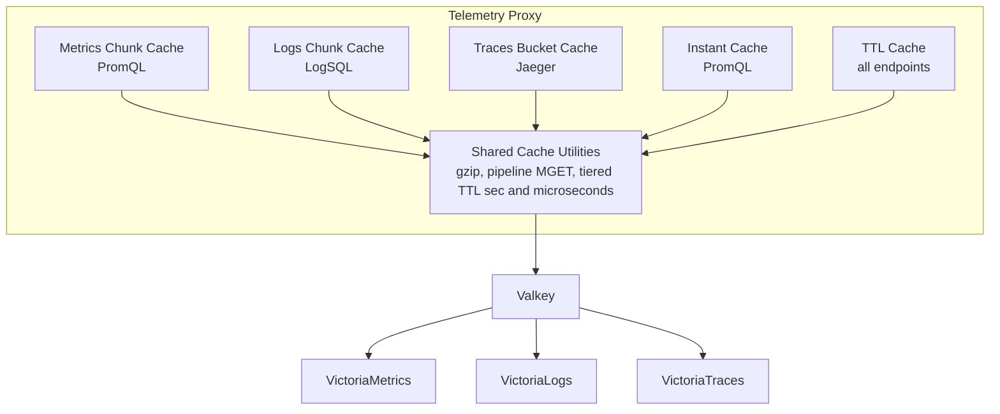
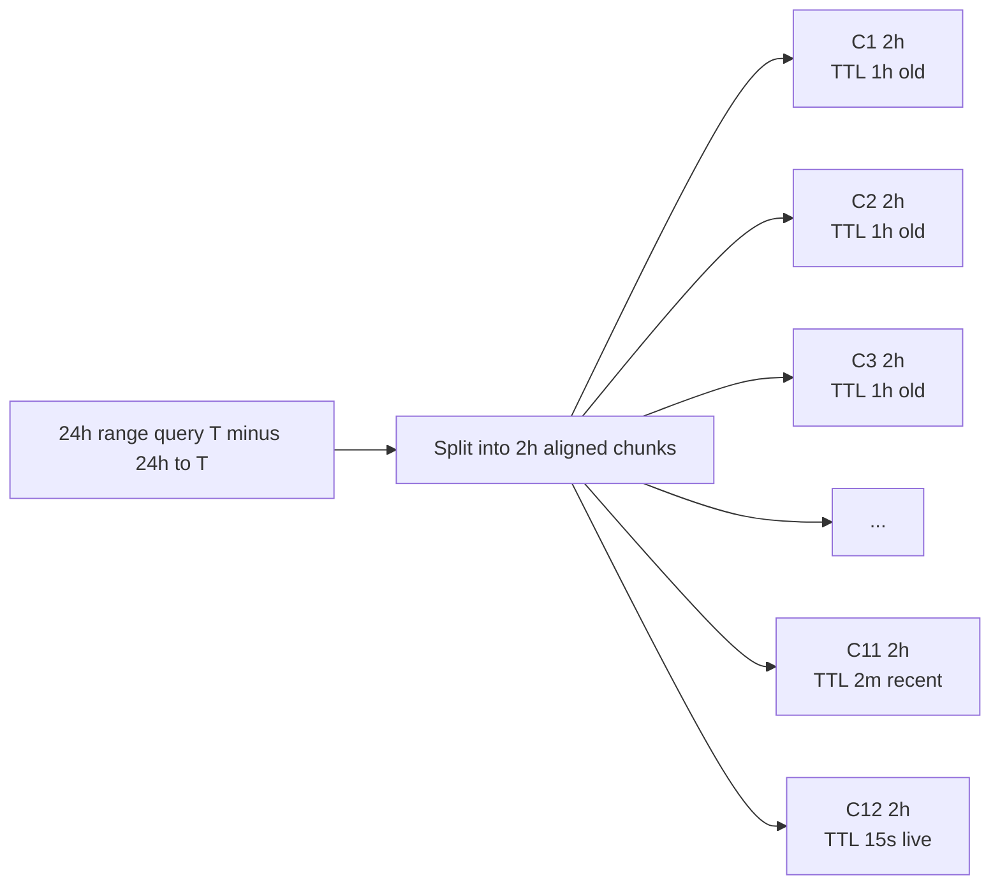
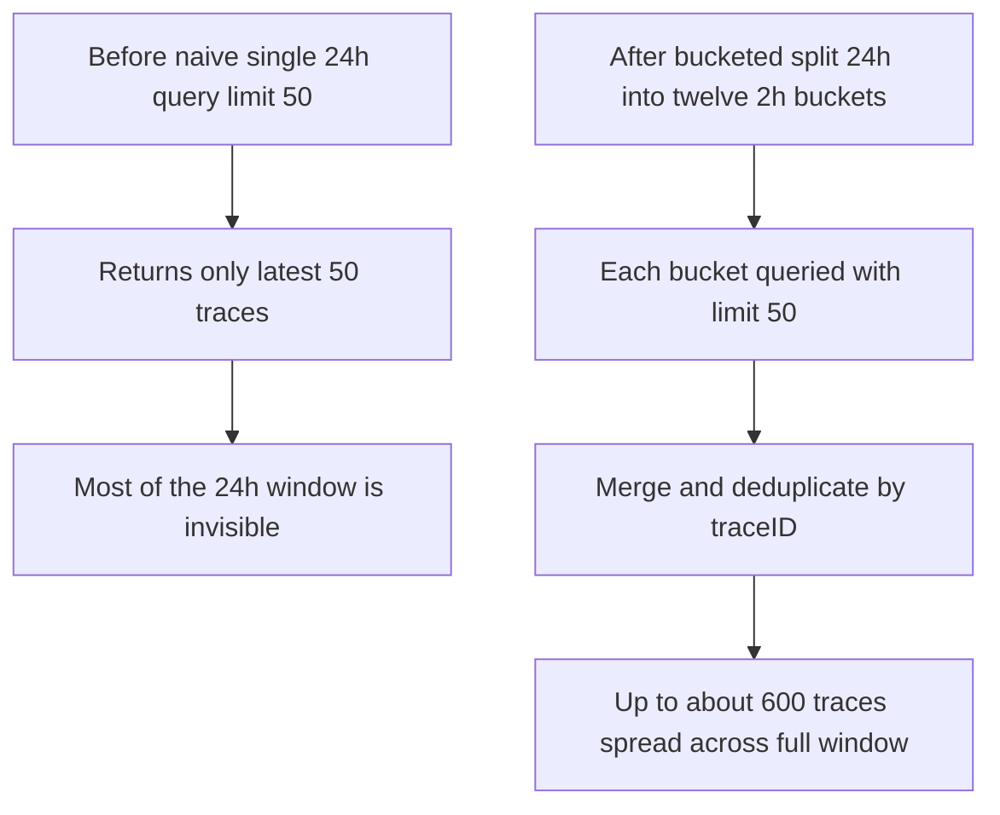

# How We Made Telemetry Queries 10x Faster: Chunk-Split Caching for Metrics, Logs, and Traces

*Building a caching architecture that serves metrics range queries, log aggregations, and trace searches in sub-second responses — across all three observability pillars — without sacrificing freshness.*

---

At [MIRASTACK LABS](https://mirastacklabs.ai), we are building Agentic AI DevOps Toolchains starting with observability tools that help engineering teams understand what their systems are doing. Metrics, logs, and traces — the three pillars of observability — billions of data points flowing through 100% open-source observability signal stores all surfaced through a single interaction layers in fully AIR-GAPPED REGULATED DATA CENTER Environments. 

Our engineering team comes from a background of building population-scale systems and platforms. As our telemetry signals grew with scale — some running thousands of microservices generating gigabytes of telemetry per hour — the next bottleneck appeared in our **data fetch layer**, the middleware between our UI, AI Agents and the telemetry stores. The backend foundation remained strong: VictoriaMetrics, VictoriaLogs, and VictoriaTraces continued to handle scale exactly as designed.

This is the story of how we redesigned the caching layer, and the engineering decisions behind a  system that now serves most queries in under 50 ms — across metrics, logs, AND traces — even when the underlying data spans a week and billions of raw data points. The same telemetry fabric is consumed by MIRASTACK AI Agents for deep correlation, failure detection, and near-real-time Root Cause Analysis, known internally as **#5YRCA**. For us, it is neither fair nor efficient to push that entire agentic-analysis burden directly onto the Victoria stack query path. 

This solution was implemented to preserve backend efficiency, protect query latency, and let both observability and AI analysis pipelines scale cleanly together.

---

## The Problem: Death by a Thousand Queries — Across All Three Pillars

Here's what happens when someone opens our App Performance page for a single service:

**Metrics (VictoriaMetrics):**
1. **30+ PromQL queries** fire in parallel — throughput, error rate, P50/P95/P99 latency, anomaly scores, dependency graphs
2. **6 metric probe queries** determine which histogram naming convention the collector uses
3. **2 service graph probes** detect metric naming variants

**Logs (VictoriaLogs):**
1. **Log volume histograms** (`stats_query_range`) for the service — error distribution over time
2. **Hit count aggregations** (`hits`) showing log lines per severity level
3. **Field facets** — what fields exist in the logs for this service

**Traces (VictoriaTraces):**
1. **Trace search** across the entire time window — find all traces touching this service
2. **RED metrics from traces** — rate, errors, duration computed from span data via LogSQL
3. **Service dependency graph** — which services call what, derived from trace analytics
4. **Operations list** — what endpoints this service exposes, fetched from the Jaeger API

That's **50+ HTTP round-trips** split across three different backends (the exact count depends on which panels are visible and which probes are warm). Now multiply that by 200 users viewing dashboards simultaneously, with auto-refresh every 30 seconds.

**200 users × 50 queries × every 30 seconds = ~20,000 backend queries per minute**, split roughly 60% metrics, 25% logs, 15% traces. Most return identical or near-identical results to what was fetched 30 seconds ago.

---

## The Insight: Telemetry Data Has a Natural Temporal Cache Structure

Here's what we realised — and this applies across **all three pillars**, not just metrics:

### Metrics: Historical data is immutable
A metric value recorded at 2:00 PM yesterday will never change. The TSDB has committed it.

### Logs: Historical aggregations are stable
A `stats_query_range` result asking "how many ERROR logs per minute yesterday" won't change — those logs are indexed and immutable. Only the current minute is still receiving writes.

### Traces: Committed traces never change
A trace that completed 10 minutes ago — its spans, durations, tags, processes — is **immutable**. The Jaeger API will return the exact same JSON for that trace for eternity. Only traces from the last few seconds might still have spans arriving.

The live edge exists in all three domains, but it's narrow. For a 24-hour query:
- **23 hours and 55 minutes** of data that will never change (metrics, logs, AND traces)
- **5 minutes** of data that's still being written

If we could cache the historical portion with a long TTL and only re-fetch the live edge — across all three backends — we'd eliminate the vast majority of upstream calls.

---

## The Architecture: Five Strategies for All Query Patterns

We identified five distinct query patterns spanning all three telemetry backends and designed a purpose-built cache strategy for each:



---

### Strategy 1: Metrics Chunk-Split Cache (PromQL Range Queries)

This is where the journey started. A long time-range PromQL query gets decomposed into clock-aligned **chunks**, each cached independently with an age-based TTL.



The algorithm runs in **9 steps**:

1. **Full-result cache check** — Return immediately if cached (120 s TTL)
2. **Short-range bypass** — Queries under 10 minutes go direct (chunking overhead not worth it)
3. **Canonical step selection** — Different auto-step values map to the same canonical step, sharing cache entries
4. **Chunk splitting** — Clock-aligned boundaries ensure overlapping time windows share chunks
5. **Batch cache lookup** — All chunk keys fetched in a single `MGET` (one round-trip)
6. **Parallel fetch of misses** — Bounded concurrency (max 6 workers)
7. **Merge** — Deduplicate by timestamp (same PromQL at same timestamp = same value)
8. **Downsample** — Resample from canonical to user-requested step
9. **Cache the full result** — Store assembled result for fast repeat access

**The key innovation — tiered TTL** — applies the same way across all three backends:

| How old is this chunk? | TTL |
|------------------------|-----|
| Less than 1 minute | 15 seconds |
| Less than 5 minutes | 2 minutes |
| Older than 5 minutes | **1 hour** |

A 24-hour metrics query produces ~12 chunks of 2 hours each. After the first request, 11 of the 12 are cached for a full hour (only the live chunk needs re-fetching). The next user gets 11 cache hits and 1 backend call — a **~92% reduction** in upstream queries.

---

### Strategy 2: Logs Chunk-Split Cache (LogSQL Range Queries)

Once we proved chunk-splitting worked for metrics, the obvious question was: can we apply the same pattern to logs?

The answer is yes — but with critical differences in **merge semantics** and **time filtering**.

#### LogSQL stats_query_range — The Well-Behaved Sibling

VictoriaLogs exposes a `stats_query_range` endpoint that returns time-series aggregations over log data — "how many ERROR logs per minute over the last 24 hours." The response shape is nearly identical to PromQL range queries. We reuse the exact same 9-step algorithm with the same chunk tier table.

The merge semantics are the same as metrics: deduplicate by timestamp. An aggregation at timestamp T over the same log data is deterministic.

**Where it's used**: This single cache strategy serves **six different route files** — log explorer, trace analytics, RED report generation, RED metrics dashboards, and the main server routes. That's the power of a well-designed abstraction: one caching implementation, six consumers.

#### LogSQL hits — The One That Tried to Break Us

The `/select/logsql/hits` endpoint returns hit count histograms: "how many log lines matched this query per time bucket, grouped by field." Looks simple. It's not.

**Problem 1: Time filtering lives in the query, not the URL.**

The `hits` endpoint doesn't accept `start`/`end` as query parameters. Time filtering must be embedded in the LogSQL query itself:

```bash
Original query: error AND service:payments
Chunk query:    _time:[2024-01-15T00:00:00Z, 2024-01-15T01:00:00Z) AND (error AND service:payments)
```

This means our chunk-split code has to rewrite the query for each chunk, injecting a `_time` filter. If the original query is `*` (match all), we use just the time filter without `AND`.

**Problem 2: Hit counts are additive, not idempotent.**

This is the one that would silently corrupt data if you got it wrong. Metric values at timestamp T are deterministic — the same PromQL evaluation at the same timestamp produces the same value. Deduplicating overlapping chunks is safe.

Hit counts are **additive**. If a time bucket straddles two chunks, each chunk returns a partial count for that bucket. You must **sum** the overlapping values, not deduplicate them:

```bash
Chunk 1 returns: { "14:00": 42, "14:05": 31 }
Chunk 2 returns: { "14:05": 17, "14:10": 89 }

WRONG (deduplicate): { "14:00": 42, "14:05": 31, "14:10": 89 }  ← 14:05 undercounted!
RIGHT (sum):         { "14:00": 42, "14:05": 48, "14:10": 89 }  ← correct total
```

We designed the merge semantics per-endpoint from the start rather than applying a one-size-fits-all deduplication. The downsampling follows the same principle: metric downsampling picks the first sample per bucket, while hits downsampling **sums** values per bucket.

**Where hits caching is used**: Both the Log Explorer and the Trace Explorer use hits aggregations — traces analytics surfaces log hit counts correlated with trace data, so the same LogSQL hits cache serves both pages.

---

### Strategy 3: Traces Bucketed Search Cache (Jaeger API)

This is the strategy that didn't exist in our first iteration — and the one that made the most dramatic difference for trace-heavy workflows.

#### The Jaeger Limit Problem

The Jaeger trace search API (`/api/traces`) accepts a `limit` parameter that caps results per request. Send `limit=50` over a 24-hour window, and you get the 50 most recent traces. Which means:

- A trace that caused a P1 incident at 3 AM? **Not in the results.**
- The slow outlier at 11 AM that affected 10,000 users? **Not in the results.**
- 23 hours of system behaviour? **Invisible.**

The standard advice is "narrow your time range." That's user-hostility disguised as a feature.

#### The Fix: Time-Bucketed Search

We split the 24-hour search window into **time buckets**, search each bucket independently with its own limit, then merge the results:



The algorithm runs in **6 steps**:

1. **Full-result cache check** — Return immediately if cached
2. **Split into clock-aligned time buckets** — Auto-select bucket size based on time range
3. **Batch cache lookup** — Pipeline MGET for all bucket keys
4. **Parallel fetch of misses** — Bounded at 6 concurrent Jaeger API calls
5. **Merge and deduplicate** — By traceID (not by timestamp — traces aren't time-series)
6. **Cache the full result**

#### Microsecond Timestamps

Here's a subtlety that bit us early: the Jaeger v1 API (which VictoriaTraces exposes) uses **microsecond** timestamps, not seconds. (Note: while the OpenTelemetry specification defines trace timestamps in nanoseconds, the Jaeger search API uses microseconds — a distinction that matters for bucket arithmetic.) Our tiered TTL function — originally built for seconds-precision metrics — needed a microsecond variant:

```bash
age_seconds = (now_microseconds - chunk_end_microseconds) / 1,000,000
```

The bucket boundary arithmetic also uses microseconds. Getting this wrong means buckets misalign, cache keys don't match, and you get zero cache hits while wondering why your cache "isn't working."

#### Auto-Bucket Sizing

The bucket size auto-selects based on the time range, keeping the bucket count reasonable:

| Query Range | Bucket Size | Approx. Buckets |
|-------------|-------------|------------------|
| ≤ 5 min | 1 min | 5 |
| 5 min – 30 min | 5 min | 6 |
| 30 min – 2 h | 15 min | 8 |
| 2 h – 6 h | 30 min | 12 |
| 6 h – 24 h | 2 h | 12 |
| > 24 h | 6 h | varies |

**Safety cap**: If the calculated bucket count exceeds 120 (someone queries "last 90 days"), the bucket size automatically widens. We also cap each bucket at 1,000 traces to prevent any single Jaeger request from returning a 200 MB response.

#### Trace Merge — Deduplication by traceID

Traces aren't time-series. You don't merge them by summing values or deduplicating timestamps. A trace is a tree of spans, identified by a unique traceID. If the same trace appears in two adjacent buckets (because its spans straddle the boundary), we keep the first occurrence:

```bash
Bucket 1: [trace-abc, trace-def, trace-ghi]
Bucket 2: [trace-ghi, trace-jkl, trace-mno]    ← trace-ghi spans the boundary

Merged:   [trace-abc, trace-def, trace-ghi, trace-jkl, trace-mno]  ← deduped
```

Traces are immutable once committed, so any copy is authoritative. First-occurrence-wins avoids re-processing.

**Where it's used**: The primary trace search page uses the full bucketed search. For internal callers — business flow correlation, anchor trace search, journey flow analysis — we use a simpler 15-second TTL wrapper around raw Jaeger search, since those queries use tight time ranges that don't need bucketing.

---

### Strategy 4: Time-Quantised Instant Cache (PromQL)

Instant queries evaluate a PromQL expression at a single point in time. Our App Performance page fires 6 histogram probes within the same second, each asking "does this metric exist right now?"

We quantise the evaluation timestamp to 30-second buckets:

```bash
Query 1: time=1711900817 → quantised to 1711900800
Query 2: time=1711900818 → quantised to 1711900800  ← same bucket!
Query 3: time=1711900819 → quantised to 1711900800  ← same bucket!
```

The first query fetches from VictoriaMetrics. Queries 2–6 get the cached response. Six round-trips become one.

---

### Strategy 5: Simple TTL Cache (Metadata Across All Three Backends)

Metadata queries — from all three backends — use a straightforward `check-cache → fetch-if-miss → store` pattern with endpoint-appropriate TTLs.

**Traces:**

| Data | TTL | Why |
|------|-----|-----|
| Trace by ID | **1 hour** | Immutable once committed — the longest TTL in the system |
| Service list | 2 min | Services deploy/undeploy slowly |
| Operations | 2 min | Endpoints change rarely |

**Logs:**

| Data | TTL | Why |
|------|-----|-----|
| Full-text log query (NDJSON) | 15 s | Near-real-time, parsed from newline-delimited JSON |
| Stats query (non-range) | 30 s | Summary aggregation |
| Field names | 60 s | Schema-level metadata |
| Field values | 60 s | Value enumeration |
| Facets | 30 s | Dynamic aggregation |

**Metrics:**

| Data | TTL | Why |
|------|-----|-----|
| Label values | 2 min | Cardinality changes slowly |
| Probe results (histogram/svc graph) | 5 min | Metric naming doesn't change mid-flight |

---

## The Shared Foundation: Making It All Fast

Four utilities underpin every strategy across all three backends:

### Transparent Gzip Compression

Each backend produces large JSON in its own way:
- **Metrics**: 24 h × 15 s step × 100 series → ~1.5 MB of PromQL JSON
- **Logs**: Hit count histograms across 50 field values → ~800 KB
- **Traces**: A single span tree with 200 spans, processes, and tags → ~2 MB per trace search

We transparently compress entries larger than 1 KB before writing to Valkey:

| Backend | Typical Compression Ratio | Why |
|---------|--------------------------|-----|
| Metrics (PromQL JSON) | 5–10× | Repetitive label key-value pairs |
| Logs (NDJSON/stats JSON) | 3–8× | Repetitive field names across log lines |
| Traces (Jaeger JSON) | 4–8× | Repeated process maps, service names, tag arrays |

Detection is automatic: we check for gzip magic bytes on read and decompress transparently. Entries exceeding 15 MB are silently skipped.

### Pipeline MGET

When a query splits into 8 chunks (metrics), 12 buckets (traces), or 6 chunks (logs), naively checking each key means many round-trips. `MGET` collapses them all into **one round-trip**:

```bash
Sequential:  12 keys × ~0.5 ms RTT = ~6   ms
Pipeline:     1 MGET × ~0.5 ms RTT = ~0.5 ms
```

This is identical for metrics chunks, log chunks, and trace buckets. The same `pipelineMGet` function serves all three.

### Tiered TTL — Seconds and Microseconds

The three-tier TTL applies identically across backends:

| Chunk Age | TTL | Metrics | Logs | Traces |
|-----------|-----|---------|------|--------|
| < 1 min (live) | 15 s | ✓ | ✓ | ✓ |
| < 5 min (recent) | 2 min | ✓ | ✓ | ✓ |
| ≥ 5 min (historical) | 1 hour | ✓ | ✓ | ✓ |

The difference: metrics and logs use seconds-precision timestamps, traces use microseconds. We provide two variants of the same function — one divides by 1, the other divides by 1,000,000 — to compute chunk age correctly.

### Graceful Degradation

The cache is never in the critical path for correctness — for any backend:

```javascript
try {
  return cache_strategy.execute(query)
} catch {
  // Valkey is down? Go direct to VictoriaMetrics/Logs/Traces.
  return direct_fetch(query)
}
```

If Valkey goes down, all three cache strategies transparently fall back to direct backend queries. Users experience slower responses but never see errors. When Valkey comes back, the cache warms organically.

---

## Real-World Impact

### Quantitative: What the Code Guarantees

| Metric | Before | After (from cache architecture) |
|--------|--------|----------------------------------|
| Backend calls per 24 h metrics query | 1 large range query | 1 live chunk re-fetch + 11 cache hits (~92% reduction) |
| Backend calls for 24 h trace search | 1 Jaeger query returning only last N traces | 1 live bucket re-fetch + 11 cache hits |
| Histogram probe overhead per page load (warm) | 6 instant queries | 0 (cached for 5 min) |
| Repeated identical query (any backend) | Full backend round-trip | Valkey cache hit (~sub-ms) |
| Trace search coverage (24 h window) | Last `limit` traces only | Traces distributed across all 12 buckets — full time coverage |
| Metadata refresh (services, labels, fields) | Every page load from backend | Cached at 30 s–120 s TTLs |

Note: Latency improvements depend on deployment topology (Valkey latency, backend response times, network). The architecture eliminates redundant upstream calls; actual wall-clock gains vary by environment.

**The trace bucketing benefit deserves special emphasis**: Before, a 24-hour trace search returned only the most recent N traces within the limit. After, traces are distributed across the entire window — every 2-hour bucket is represented — giving users full visibility into system behaviour across the entire time range.

---

## Design Decisions Worth Highlighting

### Why the Same Chunk-Split Pattern Across Three Different Backends?

The fundamental insight — "old data doesn't change, so split along time boundaries" — applies universally to metrics, logs, and traces. By designing a shared abstraction (cache utilities, pipeline MGET, bounded worker pool, tiered TTL), we implemented three separate strategies without tripling the code:

| Component | Shared | Per-Backend |
|-----------|--------|-------------|
| Gzip compression | ✓ | |
| Pipeline MGET | ✓ | |
| Tiered TTL | ✓ (sec + µs variants) | |
| Bounded worker pool | ✓ | |
| Chunk/bucket splitting | | Metrics (seconds), Logs (seconds), Traces (microseconds) |
| Merge semantics | | Dedup (metrics), Dedup (log stats), Sum (log hits), TraceID dedup (traces) |
| Time filter injection | | Log hits embeds `_time` in query |
| Auto bucket sizing | | Traces (6 tiers + safety cap) |

### Why Different Merge Semantics per Backend?

This is the design decision that prevents silent data corruption:

- **Metrics**: Same PromQL at same timestamp = same value → deduplicate
- **Log stats**: Same aggregation at same timestamp = same value → deduplicate
- **Log hits**: Counts are additive across chunk boundaries → **sum**
- **Traces**: Immutable objects identified by unique ID → **deduplicate by traceID**

A one-size-fits-all merge function would silently undercount log volumes or duplicate traces. We caught this early because we designed merge semantics per-endpoint from the start.

### Why Clock-Aligned Chunks?

If User A queries `[14:02, 14:32]` and User B queries `[14:05, 14:35]`, free-form chunks would be completely different. Clock-aligned chunks snap to wall-clock boundaries, so overlapping middle chunks share cache entries. This applies identically to metrics chunks, log chunks, and trace buckets — humans across the same team tend to look at similar time ranges.

### Why Microsecond Arithmetic for Traces?

The Jaeger v1 API uses microsecond timestamps (the OpenTelemetry specification uses nanoseconds, but VictoriaTraces exposes the Jaeger API). If you use seconds-precision arithmetic for trace bucket boundaries, your buckets misalign by up to 999,999 microseconds — nearly a full second. Cache keys won't match between requests, hit rate drops to zero, and you've built an expensive no-op. We learned to provide a dedicated `tieredChunkTTLMicros` function alongside the seconds variant.

### Why Auto-Widen Trace Buckets?

Unlike metrics (where chunk size is deterministic from the tier table), trace searches can span very long time ranges. A "last 90 days" search at 2-hour buckets would produce 1,080 buckets — 1,080 Jaeger API calls. The MAX_BUCKETS=120 safety cap auto-widens bucket size to keep the request count bounded, at the cost of coarser cache granularity for very long ranges.

### Why Sum for Hits Downsampling?

Metric downsampling picks the first sample per target bucket — because you're resampling a continuous signal. Hits downsampling **sums** values per target bucket — because you're aggregating counts. Using the wrong downsampling function for hits would silently lose log volume data.

---


---

## What We'd Do Differently

**Cache warming**: Currently, the cache warms organically from user traffic. For critical dashboards with known query patterns, a background warmer that pre-fetches historical chunks and trace buckets during low-traffic periods would further reduce first-load latency.

**Adaptive chunk sizing**: Our fixed tier tables work well for most workloads, but extremely high-cardinality metric queries (10,000+ series) and high-volume log queries produce large chunks. An adaptive system that adjusts chunk size based on estimated result size would optimise Valkey memory usage.

**Write coalescing**: When 50 users hit the same uncached query simultaneously, all 50 fetch from the backend. A "single-flight" pattern (coalescing concurrent requests for the same cache key into a single backend call) would eliminate this thundering herd — especially impactful for trace searches where each Jaeger API call is expensive.

**Cross-backend preloading**: When a user opens the App Performance page, we know they'll query metrics, logs, AND traces for that service. Proactively warming the caches for all three backends in parallel (instead of waiting for each component to mount and fire its own requests) would cut perceived load time further.

---

## Why We Chose VictoriaMetrics As Our Observability Backend

We want to extend sincere thanks to the [VictoriaMetrics Engineering Team](https://victoriametrics.com/) for building and maintaining exceptional open source observability infrastructure.

Their continued contributions to the open source ecosystem enable engineering teams around the world to build reliable, high-performance systems on transparent and battle-tested foundations.

We chose the VictoriaMetrics stack deliberately. For our roadmap, observability is foundational infrastructure, not a sidecar decision. We needed a backend that scales with product ambition and remains economically efficient under sustained load.

1. **Horizontal scaling by design**  
  The VictoriaMetrics ecosystem gives us a practical scale-out path for real production workloads. For example, VictoriaLogs cluster mode uses the same binary with different flags, so teams can expand capacity without a separate "cluster edition" migration step. The gateway and storage role separation (including stateless gateway patterns) also maps cleanly to modern Kubernetes operations and progressive scaling strategies.  


2. **Extreme resource optimization and cost efficiency**  
  The VictoriaMetrics team consistently publishes benchmark-driven engineering and resource-usage analysis in public. Their performance work and cost-focused product improvements reinforce why we trust this stack for high-ingest telemetry while maintaining disciplined infrastructure spend at scale.

If you build serious observability systems, we strongly recommend following the [VictoriaMetrics engineering blog](https://victoriametrics.com/blog/) for architecture, performance, and production operations insights.

If you have not explored their work yet, we highly recommend visiting [victoriametrics.com](https://victoriametrics.com/).

---

## Conclusion

The fundamental insight is deceptively simple: **telemetry data — metrics, logs, and traces — all share a natural temporal cache structure**. Old data doesn't change, regardless of which backend stores it. Split along time boundaries, cache aggressively, merge correctly (deduplicate for metrics, sum for hit counts, deduplicate-by-ID for traces), and degrade gracefully.

The implementation required careful attention to three different merge semantics, two timestamp precisions, time-filter injection for endpoints that don't accept time parameters, and safety caps for unbounded searches. But the result is a system where the same architectural pattern — chunk-split with tiered TTL — applies across all three observability pillars, sharing infrastructure while respecting the unique semantics of each data type.

For a platform serving population-scale observability data across metrics, logs, and traces, the caching layer is the difference between a system that groans under load and one that hums — regardless of which backend the user is querying.

---

*This post is part of the MIRASTACK LABS engineering blog series on building production-grade Agentic AI + AIR-GAPPED environments for highly secure and regulated entities*
