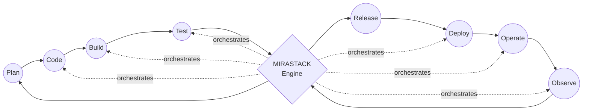
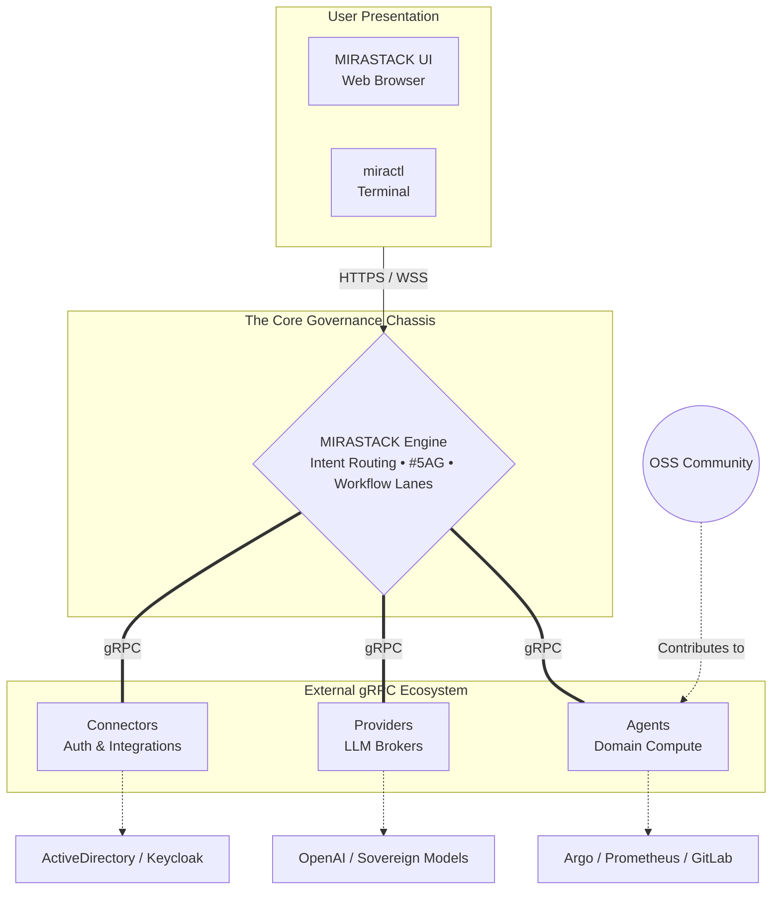
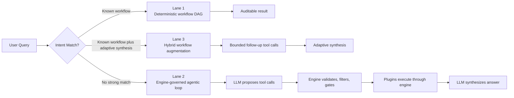

# Why MIRASTACK Is The Anti-Rogue AI Platform for DevOps

*A deep look at the architectural thesis behind MIRASTACK: a stateless, governed, plugin-driven AI engine for platform engineering across the full DevOps Infinity Loop.*

---

The operational surface area is expanding, but the tools to manage it are breaking. Platform teams are stuck in a painful tradeoff: either hardcode static automation that shatters at the edges, or trust AI tools that look incredible in demos but cannot safely be given access to a production namespace. 

MIRASTACK starts from a different premise.

> **Kubernetes orchestrates applications; MIRASTACK orchestrates AI agents.**

That line is not a marketing slogan. It is our core product thesis. We are building MIRASTACK as the AI-native DevOps Infinity Loop: a programmable governed engine for platform engineering that operates consistently across planning, code, build, test, release, deploy, operate, and observe. 

Not as eight disconnected chatbots. Not as a fragile chain of prompts. As a governed execution system designed from first principles to survive real enterprise conditions.

## The Category Gap MIRASTACK Is Targeting

There is no shortage of AI frameworks, workflow builders, and generic coding copilots. But the industry is currently obsessed with "autonomous agents" that hallucinate their way through complex systems without boundaries. 

Enterprise platform teams do not need another prompt layer. They need an execution environment that can:

- operate smoothly in strict air-gapped and sovereign environments
- separate generative reasoning from deterministic execution
- validate and filter tool inputs before dispatching them
- enforce role-aware approvals out-of-the-box on every state-changing action
- maintain an immutable audit trail of every operational decision
- turn ad hoc 3:00 AM incident investigations into repeatable, automated workflows over time

Right now, some tools specialize in human-authored workflows. Others specialize in open-ended agentic AI. MIRASTACK is the governed chassis that brings those two worlds together, preventing the whole operational stack from collapsing into chaos.

## The DevOps Infinity Loop, Rewired for AI

Platform teams should not have to jump across isolated islands for each stage of the DevOps lifecycle. The platform should understand the whole operational loop and intelligently coordinate action across it.

<!-- Option A: Code-driven Mermaid Diagram -->

The value of the Infinity Loop is not just coverage; it is continuity. A release decision should be able to reason over build health. An incident workflow should be capable of pulling correlated traces, logs, metrics, and service topology all at once. An observation loop should be able to feed directly into repeatable, self-healing remediation.

## MIRASTACK’s Core Thesis: The Engine Is the Chassis

The central architectural idea behind MIRASTACK is simple: **the engine is the chassis**, and every capability plugs into it externally. 

In MIRASTACK, the engine is the proprietary, governed control plane. Nothing else is built inside it. There are exactly three plugin types in the ecosystem, and they operate strictly as external gRPC processes:

1. **Agents:** Pure domain compute that perform tasks on external systems when the engine commands them.
2. **Providers:** AI inferencing brokers for LLM backends (such as OpenAI, Anthropic, LM Studio, Ollama, or vLLM).
3. **Connectors:** Integrations that enrich engine-level capabilities, such as linking `mirastack-engine` to enterprise Auth systems.

We are inviting the OSS community to start contributing new MIRASTACK agents; the full OSS invitation is detailed in **The OSS Agent Initiative** section below.

This matters because it keeps the platform honest. Agents do not bypass the engine. Providers do not leak AI calls into random parts of the codebase. Every meaningful interaction flows through one single, highly governed runtime.

## Stateless by Design, Not by Slogan

MIRASTACK is designed as a stateless engine executing a deliberate two-store model.

**Kine** securely handles persistent state through an etcd-style API. This is where long-lived system truths live: workflow definitions, agent metadata, approval policies, and AAAA mappings.
**Valkey** handles transient operational state: high-speed execution progress, caches, histories, and session activity.

This separation is operationally vital. It means the engine keeps zero in-memory state as a dependency for correctness. An engine instance can instantly resume any execution if another instance fails at runtime. Scaling the AI control plane becomes deterministic, predictable, and resilient.

## The Anti-Rogue AI Framework: Three Execution Lanes

Operational work is not uniform. That is why MIRASTACK does not force everything into an unpredictable LLM prompt. Instead, we route every request into one of three execution lanes.

### Lane 1: Deterministic Workflows
Fast, entirely auditable, operational DAGs. This is where teams encode hardened platform procedures and runbooks that require zero generative interpretation.

### Lane 2: Engine-Governed Agentic Loops
When there is no predefined workflow, the engine activates an agentic ReAct loop. **Here, the LLM proposes tool calls, but the engine decides.** 

MIRASTACK prevents the hallucination nightmare. AI is great until it deletes a production namespace. By enforcing that the LLM only proposes while our deterministic engine filters, gates, and disposes (strictly bound by your RBAC limits), platform teams get the flexibility of open-ended analysis without surrendering an ounce of operational control. 

### Lane 3: Hybrid Workflow Augmentation
Some workflows hit an ambiguous edge case near the end. Lane 3 allows a deterministic workflow to hand off to an LLM for bounded, tightly constrained adaptive reasoning and synthesis, combining safety with generative insight.

## Day-0 Governance: The #5AG Framework

In the autonomous AI era, governance cannot be an afterthought, a wrapper, or a compliance checkbox. If the underlying execution engine isn't secure by design, "autonomy" is just an elegant word for liability.

In MIRASTACK, governance *is* the runtime. We architected the platform around the **5A Governance (#5AG)** framework—five non-negotiable pillars forged directly into the engine's chassis from Day 0:

- **Authentication (Ironclad Identity):** Zero trust by default. We natively leverage symmetric PASETO tokens, entirely bypassing the historical fragilities and spoofing risks of standard JWTs.
- **Authorisation (Precision Boundaries):** Deeply baked Role-Based Access Control (RBAC). Agents act as extensions of the user, guaranteed to never transcend the permission scope of the human operator that invoked them.
- **Approvals (Human-in-the-Loop):** The ultimate circuit breaker. While read-only investigations sprint autonomously, any structural `MODIFY` or `ADMIN` payload instantly halts the execution pipeline. The engine fires an approval request and waits for explicit, cryptographic sign-off from an authorized platform engineer.
- **Audit / Action Logs (Absolute Accountability):** No black boxes. The engine maintains an immutable, surgical ledger of every generative intent matched, parameter marshaled, and plugin executing on the network.
- **Alerts (Proactive Radar):** Native, role-gated event streams that instantly broadcast budget exhaustion, external plugin decay, or workflow degradation directly back to the operators before small anomalies compound.

This density of control doesn't slow engineering teams down—it liberates them. When the chassis mathematically guarantees safety, enterprise teams can finally orchestrate autonomous agents in high-risk, production environments with zero hesitation.

## From "Shadow IT" to Reusable Workflow

One of the most important platform ideas inside MIRASTACK is **Workflow Promotion**.

Stop losing your complex 3:00 AM incident investigations to Slack history. Operational shadow IT and tribal knowledge are the enemies of engineering scale. With workflow promotion, MIRASTACK captures a successful, ad-hoc Lane 2 agentic loop and compiles the trace directly into a deterministic, reusable YAML DAG. 

You no longer just ask an AI a question; you mint new, repeatable, auditable playbooks that the rest of your organization can safely use.

## The OSS Agent Initiative: Own a Piece of the Infinity Loop

The MIRASTACK engine remains the governed, proprietary core of the platform. However, the capability layer—the agents connecting to the tools your teams use every day—is where we are opening the doors for massive, open-source community collaboration.

We are not just asking for generic pull requests; we are putting out a bounty board for the entire Infinity Loop.

The Kubernetes ecosystem became historic because of its plugins. The MIRASTACK ecosystem will grow because of its agents. We are looking for founding maintainers to own domain-specific agents across all eight stages of DevOps:

- **Plan:** agents for OpenProject, Plane, Backstage, or Taiga that can analyze requirements, map dependencies, and turn planning context into actionable workflows.
- **Code:** agents for Gitea, GitLab CE, and repository intelligence that assess change impact, triage PRs, and review policy.
- **Build:** agents for Jenkins, Tekton, and BuildKit that diagnose broken pipelines, and explain artifact regressions.
- **Test:** agents for Playwright, Selenium, and SonarQube that cluster test failures, summarize coverage, and detect flaky suites.
- **Release:** agents for Spinnaker, GoReleaser, and Argo Rollouts that assemble release readiness context and prepare progressive delivery decisions.
- **Deploy:** agents for Argo CD, Flux, Helm, and Kubernetes that validate manifests, detect environment drift, and compare desired versus live state.
- **Operate:** agents for AWX, Rundeck, and incident operations that handle runbooks, coordinate safe automation, and prepare actions for engine approval.
- **Observe:** agents for Prometheus, VictoriaMetrics, OpenTelemetry, Tempo, and Jaeger that correlate telemetry, investigate anomalies, and drastically accelerate root-cause analysis.

### Write 50 Lines of Code, Get an Enterprise AI Agent

We know platform engineers hate plumbing. That is why we built the `mirastack-agents-sdk-go` and `mirastack-agents-sdk-python` SDKs

You do not have to write custom LangChain wrappers, wrangle complex token window management, or hack together direct LLM API calls. If you can write a standard Go function to hit an API like GitLab or Argo, you have already done the hard part. 

Connect your existing api logic to our SDK. The MIRASTACK engine automatically grants your new agent native AI intent routing, temporal context tracking, enforced RBAC, PASETO auth, and approval gating. 

*Bring your API logic; we’ll provide the enterprise AI engine.*

## Join the Ecosystem

If you are tired of AI hype and want to build the governed operational layer of the future, we want you building with us. 

1. **Claim an Agent on GitHub:** Head over to our [GitHub Organization](https://github.com/mirastacklabs-ai) and check out the open agent requests. Submit an issue to claim a tool you want to build an agent for.
2. **Get Recognized on the Wall of Fame:** We heavily showcase our community. Agent authors will be officially listed as founding ecosystem maintainers on the upcoming **MIRASTACK Wall of Fame** on our main site.
3. **Reach Out Directly:** Have an idea for a massive workflow? Want to partner on a complex agent architecture? Let's build. Email us directly at **[agent.builders@mirastacklabs.ai](mailto:agent.builders@mirastacklabs.ai)**.

The market does not need more AI wrappers around infrastructure APIs. It needs a governed runtime that can seamlessly turn operational intelligence into safe execution.

Stop wrapping APIs. Start orchestrating operational reality.