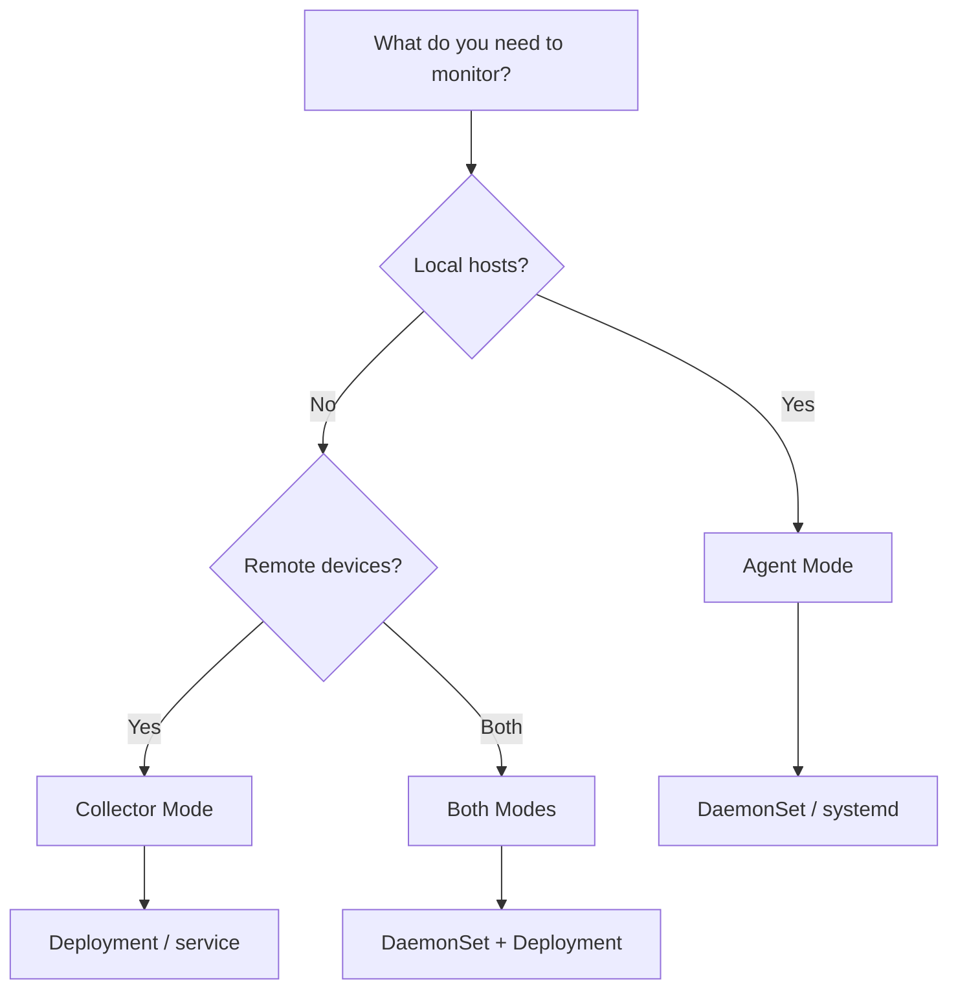

# Installation

Comprehensive guides for deploying Telegen across all supported platforms.

## Deployment Methods

| Platform | Mode | Guide |
|----------|------|-------|
| **Unified Pipeline** | All Platforms | [Deployment](deployment) |
| **Kubernetes** | Agent (DaemonSet) | [Kubernetes](kubernetes) |
| **Helm** | Agent/Collector | [Helm](helm) |
| **Docker** | Agent/Collector | [Docker](docker) |
| **Linux** | systemd service | [Linux](linux) |
| **OpenShift** | Agent (DaemonSet) | [Openshift](openshift) |
| **AWS ECS** | Agent (Daemon) | [ECS](ecs) |

New deployments should use the **Unified Pipeline** guide which includes data quality controls, transformation, and PII redaction.

## Quick Reference

### Minimum Requirements

- **Kernel**: Linux 4.18+ (5.8+ recommended)
- **CPU**: 200m
- **Memory**: 256 MB
- **Network**: Outbound to OTLP endpoint (4317/4318)

### Choosing a Deployment Mode

